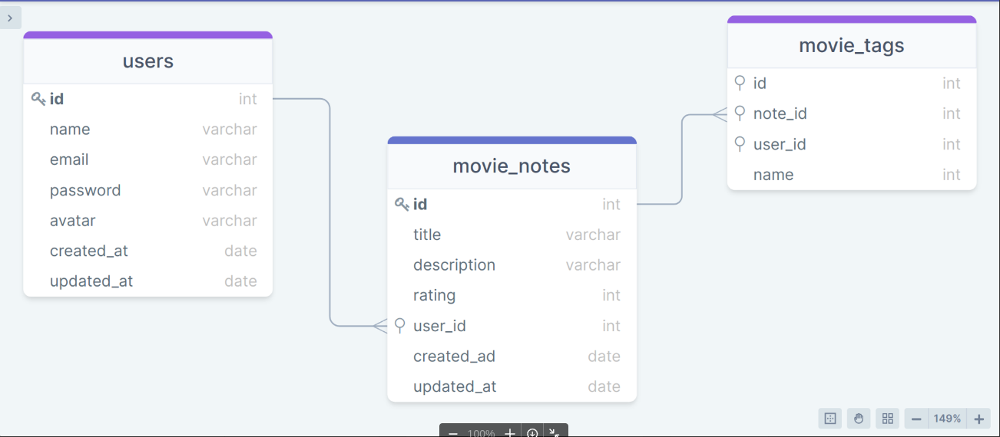

<h1 align="center"> API - Movies Notes </h1>

<h3 align="center"> Uma API que permite ao usuário cadastrar seus filmes favoritos em notas. </h3> &nbsp;

	🚀Completed project 🚀

  

&nbsp;

## 🚀 Technologies

This project was developed with the following technologies:

- [JavaScript e JSON](https://www.javascript.com/)
- [Node e NPM](https://nodejs.org/)
- [Express](https://expressjs.com/)
- [SQLite](https://www.sqlite.org/index.html)
- [Knex](https://knexjs.org/)

## 👨‍💻 Author

<a href="https://www.linkedin.com/in/daniel-guimaraes-vieira/">
 
  
 <b>Daniel Guimarães</b></a> <a href="https://www.linkedin.com/in/daniel-guimaraes-vieira/" title="Author Daniel">🚀</a>
  

## 📝 License

This project is under license [MIT](./LICENSE).

---

Made with ❤️ by Daniel Guimarães 👋🏽 [Get in touch!](https://www.linkedin.com/in/daniel-guimaraes-vieira/)
